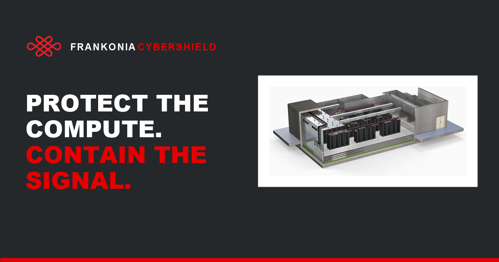

<div align="center">



# Frankonia CyberShield

**Physical and electromagnetic security for critical compute.**

The product site for Frankonia's modular RF-shielded enclosures — the rooms that wrap
AI clusters, sovereign cloud and colocation halls in a measurable electromagnetic boundary.

[](https://github.com/junhan95/CyberShield/actions/workflows/deploy-pages.yml)


### [English](https://junhan95.github.io/CyberShield/) · [Deutsch](https://junhan95.github.io/CyberShield/de/) · [한국어](https://junhan95.github.io/CyberShield/ko/)

</div>

---

## What this is

A single-page product site, prerendered to static HTML and served from GitHub Pages.
Three fully translated locales, two standalone legal pages, no client-side data fetching
and no tracking of any kind.

| Route | Locale | Page |
|---|---|---|
| [`/`](https://junhan95.github.io/CyberShield/) | English | Landing |
| [`/de/`](https://junhan95.github.io/CyberShield/de/) | Deutsch | Landing |
| [`/ko/`](https://junhan95.github.io/CyberShield/ko/) | 한국어 | Landing |
| [`/privacy/`](https://junhan95.github.io/CyberShield/privacy/) | English | Privacy policy |
| [`/imprint/`](https://junhan95.github.io/CyberShield/imprint/) | English | Imprint |

## Highlights

**Trilingual from one component.** Every string lives in a single `copy` object keyed by
locale, so EN / DE / KO render from the same tree. The German copy uses real EMC shielding
terminology — *Schirmdämpfung*, *Wabenkamin*, *Hohlleiter* — rather than a literal
translation of the English.

**Cut-metal wordmark, drawn in SVG.** `CYBERSHIELD` is a brushed steel sheet shown through
a double-contour letterform mask, with a polished chamfer from `feSpecularLighting` and a
cast shadow. The filter values are tuned to the 26 px header size on purpose: SVG filters
rasterise at final render scale, so a grain tuned on a large canvas dissolves into flat
grey when scaled down.

**A hero that loops both ways.** The render plays forward for 8 s, holds, runs backward,
holds, and repeats. Reversing in the browser means seeking frame by frame, which measured
at roughly 2–3 fps on this 1080p source — so the whole cycle is baked into the file and
played back natively.

**Measured, not asserted.** The attenuation band charts guaranteed shielding performance
from 10 kHz to 40 GHz against EN 50147-1 / IEEE 299, with bar heights derived from the
decibel figures rather than hand-placed.

**The brand lockup is the real artwork.** `frankonia-logo.svg` is built from vector
outlines extracted from the official brand PDF, not approximated with a web font, so the
FRANKONIA wordmark is glyph-exact.

## Stack

| | |
|---|---|
| Framework | Next.js 16 (App Router, RSC) |
| Runtime | React 19 · TypeScript 5.9 |
| Dev server | [vinext](https://github.com/cloudflare/vinext) on Vite 8 |
| Styling | Hand-written CSS in `app/globals.css` (Tailwind 4 is installed but barely used) |
| Hosting | GitHub Pages, static export |

## Local development

```bash
npm install
npm run dev
```

The dev server runs at `http://localhost:3000`.

To reproduce the production build exactly — including the `/CyberShield` base path that
GitHub Pages needs baked in at build time:

```bash
STATIC_EXPORT=1 NEXT_PUBLIC_BASE_PATH=/CyberShield NEXT_PUBLIC_SITE_ORIGIN=https://junhan95.github.io npx next build
```

Output lands in `out/`.

> **On Windows, run that from PowerShell rather than Git Bash.** Git Bash rewrites
> `/CyberShield` into a Windows path and the build fails with an invalid `basePath`.

## Layout

```
app/
  landing.tsx        # the whole landing page, and all copy keyed by locale
  brand.tsx          # cut-metal wordmark definitions, shared across pages
  legal.tsx          # shell and company details for the legal pages
  site-config.ts     # base path, locale table, asset/route helpers
  site-metadata.ts   # per-locale title, description, hreflang, Open Graph
  page.tsx           # /
  de/  ko/           # /de/  /ko/
  privacy/ imprint/  # standalone legal pages
public/
  frankonia-logo.svg     # brand lockup, vector outlines from the brand PDF
  hero-render-loop.mp4   # 20 s ping-pong cycle
  images/                # facility photography
```

`db/`, `worker/`, `examples/` and `drizzle.config.ts` are scaffolding left over from the
project starter. The site does not use them.

## Deployment

Pushing to `main` triggers [`deploy-pages.yml`](.github/workflows/deploy-pages.yml), which
runs the static export and publishes `out/` to GitHub Pages. There is no manual step.

## Notes

- Content is derived from Frankonia's CyberShield product documentation. Performance
  figures, standards and certification scope depend on the agreed project configuration
  and final on-site validation.
- The site sets no cookies and embeds no analytics. The only third-party request is
  Google Fonts.
- The imprint carries the statutory details of Frankonia Germany EMC Solutions GmbH.

---

<div align="center">
<sub>© 1987 Frankonia Group · <a href="https://frankonia-solutions.com/">frankonia-solutions.com</a></sub>
</div>
